# NotesApp - Flutter Aplication

<div align="center">
<url>
  
  </div>
<div align="center">
Institut Teknologi dan Bisnis Bina Sarana Global <br>
FAKULTAS TEKNOLOGI INFORMASI & KOMUNIKASI 
<br>
https://global.ac.id/
  </div>

  ##  Project UAS
  - Mata Kuliah : Aplikasi Mobile
  - Kelas : TI 23 M SE
  - Semester : GANJIL 
  - Tahun Akademik: 2025 - 2026

## About The Project

Notes App merupakan aplikasi mobile berbasis Flutter yang dirancang untuk membantu pengguna dalam melakukan pencatatan secara digital. Aplikasi ini dilengkapi dengan antarmuka yang sederhana dan mudah digunakan serta mendukung sinkronisasi data berbasis cloud melalui Firebase Authentication dan Cloud Firestore.

Aplikasi ini memungkinkan pengguna untuk menyimpan catatan secara pribadi maupun berbagi catatan dengan pengguna lain, sehingga mendukung aktivitas kolaboratif dalam pengelolaan informasi.

### Key Features

- **Modern UI/UX Design** – Antarmuka yang clean, responsif, dan user-friendly
- **User Authentication** – Login dan registrasi pengguna menggunakan Firebase Authentication
- **Personal Notes Management** – Membuat, mengedit, dan menghapus catatan pribadi
- **Collaborative Notes** – Berbagi catatan dengan pengguna lain untuk kolaborasi bersama
- **Push Notifications** – Reminder untuk catatan penting dan aktivitas tertentu
- **Cloud Sync** – Sinkronisasi data catatan secara otomatis menggunakan Cloud Firestore
- **Multi-Device Access** – Akses catatan dari berbagai perangkat dengan satu akun
- **Profile & Settings** – Pengelolaan profil pengguna dan preferensi aplikasi

## Screenshots

<div align="center">
1. Splash Screen & Authentication
  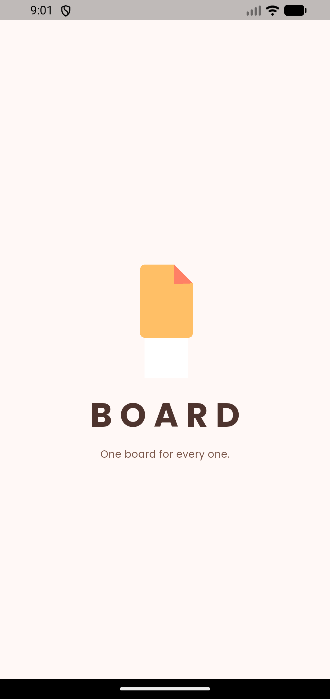
  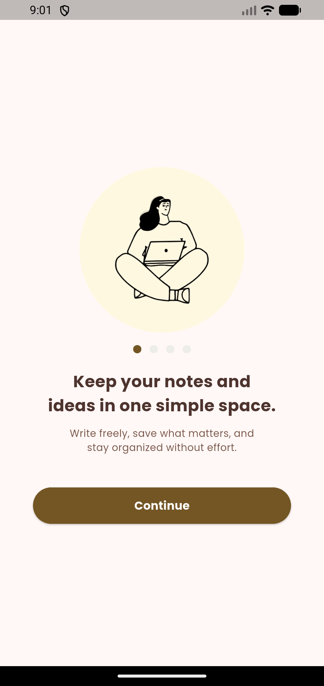
  
  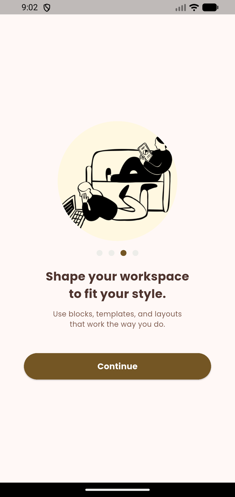
  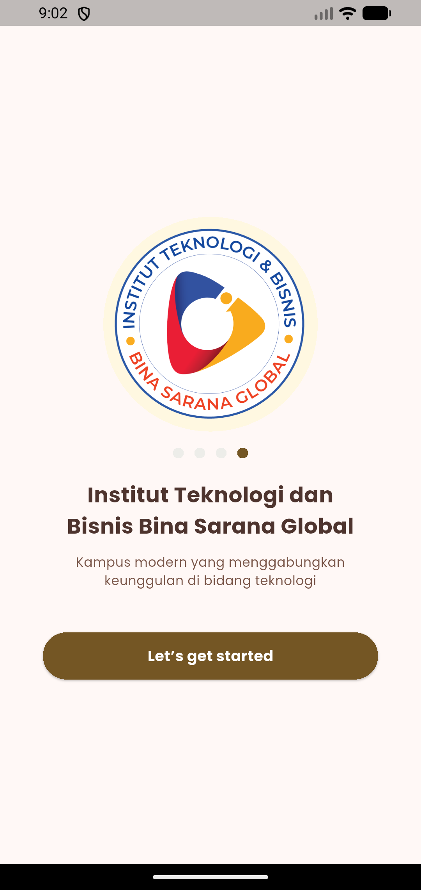
  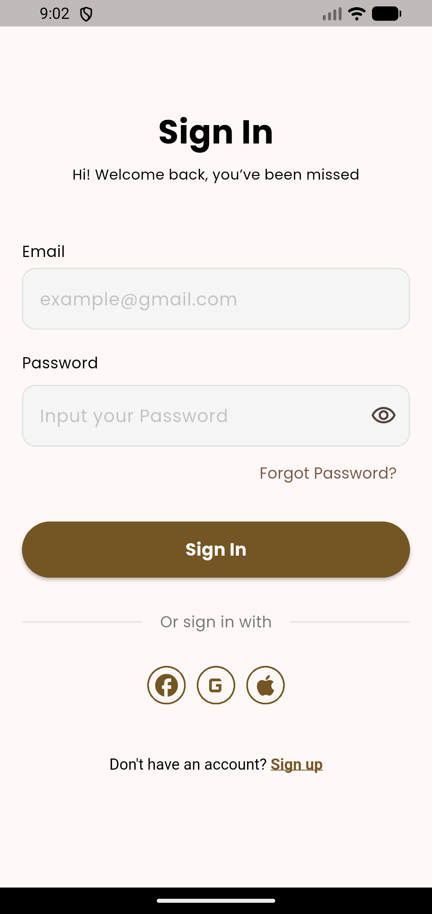

2.Fitur Aplikasi
  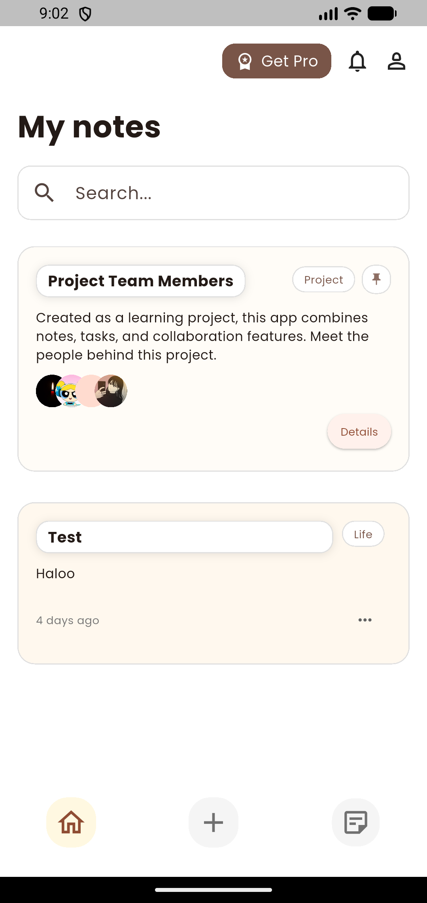
  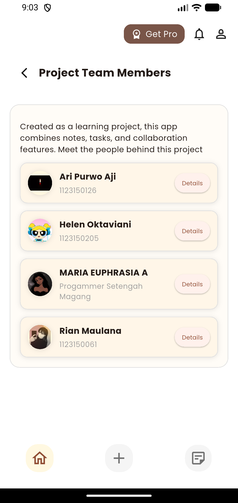
  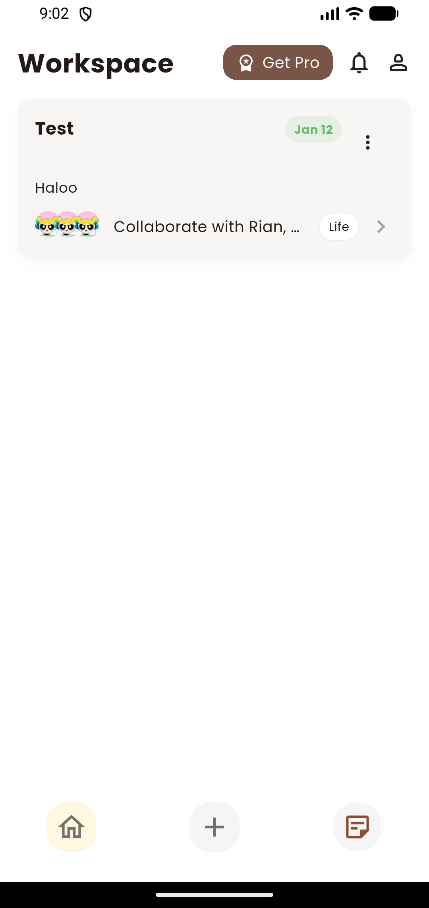
  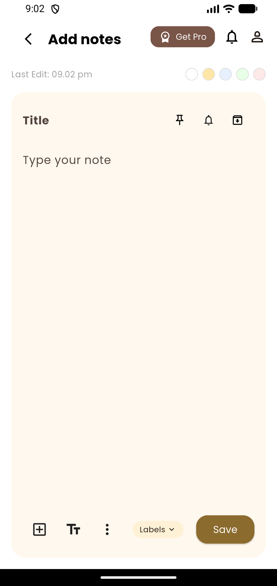
  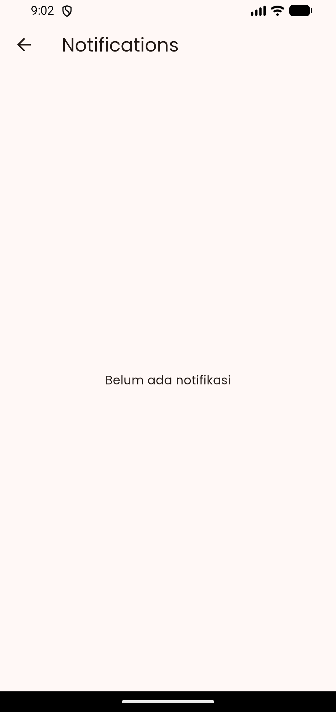
  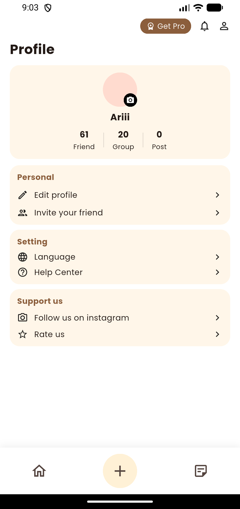
  
  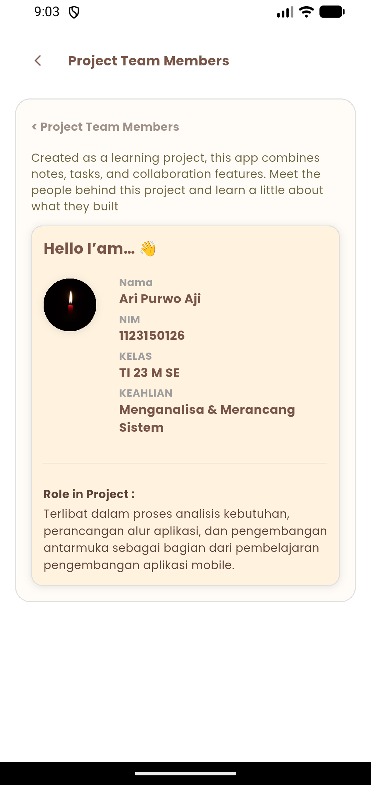
  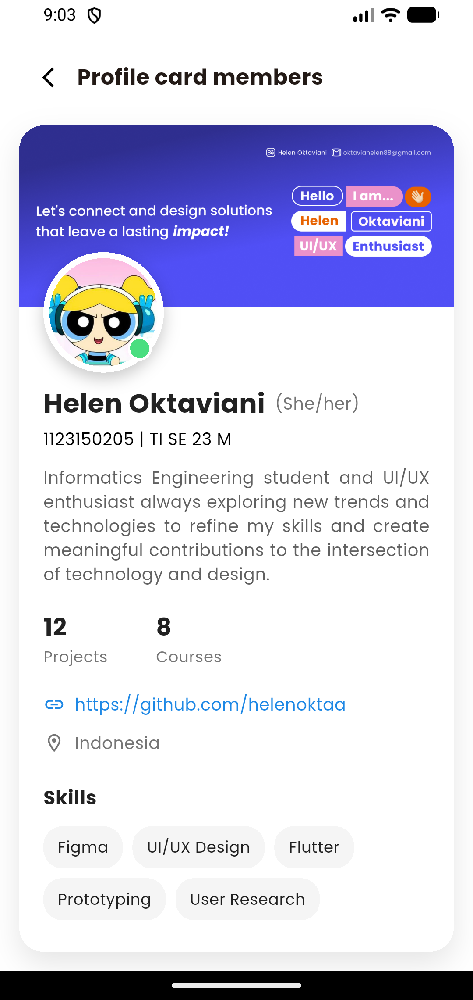
  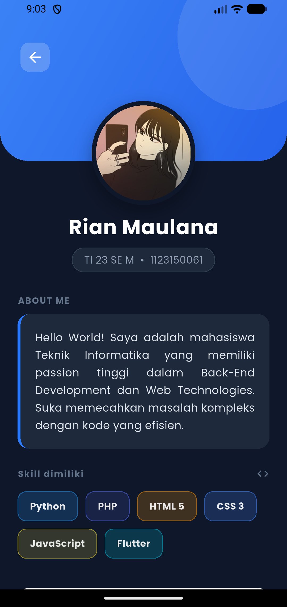
  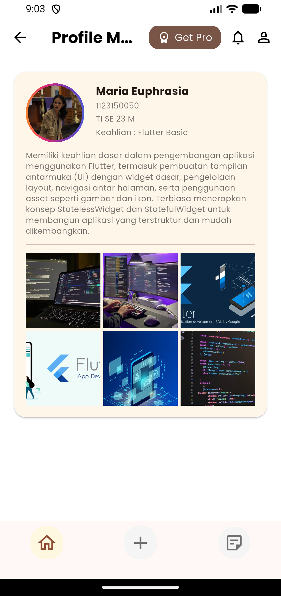
</div>

### Prerequisites

Pastikan Anda sudah menginstall:
- Flutter SDK (3.16.0 or higher)
- Dart SDK (3.2.0 or higher)
- Android Studio / VS Code
- Git

## Built With

- **[Flutter](https://flutter.dev/)** - UI Framework
- **[Dart](https://dart.dev/)** - Programming Language
- **[Firebase](https://firebase.google.com/)** - Backend & Authentication
- **[Provider](https://pub.dev/packages/provider)** - State Management

### Installation

1. Clone repository
```bash
git clone https://github.com/yourusername/notes-app.git
cd notes-app
```

2. Install dependencies
```bash
flutter pub get
```

3. Setup Firebase
```bash
# Download google-services.json dari Firebase Console
# Place in android/app/
cp path/to/google-services.json android/app/
```

4. Run aplikasi
```bash
flutter run
```

### Build APK

```bash
# Debug APK
flutter build apk --debug

# Release APK
flutter build apk --release

# Split APK by ABI
flutter build apk --split-per-abi
```
